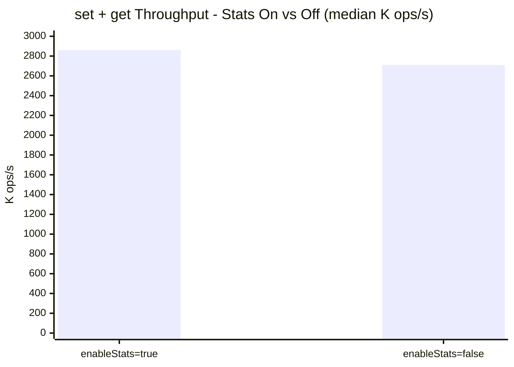
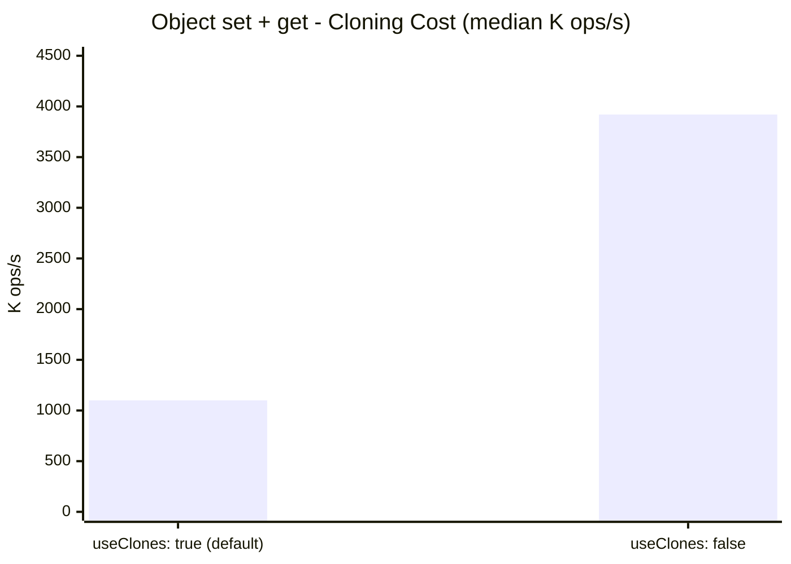

## Performance

Benchmarks run on Node v24.12.0, Windows 11 x64.

- `bench`: 7 measured runs per scenario (warmup excluded), median + p95 + min-max range.
- `bench:heap`: 9 measured runs per size, median + speedup range.

### TTL Expiry: Linear Scan vs Min-Heap

The old implementation scanned every key on each check interval. The min-heap approach touches expired keys first. Median results from `npm run bench:heap`:

```mermaid
xychart-beta
  title "TTL Expiry Check - Linear vs Heap (median ms, lower is better)"
  x-axis ["1K keys", "10K keys", "100K keys"]
  y-axis "Time (ms)" 0 --> 30
  bar "Linear (median)" [0.17, 1.40, 27.83]
  bar "Heap (median)" [0.10, 0.65, 4.48]
```



Speedup ranges (`bench:heap`, 9 runs):

| Keys | Median speedup | Range |
|---|---|---|
| 1K | 1.80x | 1.06x-2.96x |
| 10K | 2.14x | 1.59x-3.31x |
| 100K | 6.22x | 3.76x-8.16x |

### Stats Tracking

The old implementation always tracked stats. In this fork, stats are optional via `enableStats`.

Local benchmark result (`bench`, 7 runs):



This result is environment-sensitive. In local runs, `enableStats=false` was `0.95x` of `enableStats=true` median throughput, so treat this as workload-dependent.

### Cloning: Enabled vs Disabled

`useClones` cost is consistently visible in local runs:



Disabling clones gave **3.55x** median throughput in this run set (`1.10M` vs `3.92M`).

### Raw Results (from `npm run bench`, 7 runs)

| Benchmark | Median ops/s | Range (ops/s) | p95 time (ms) |
|---|---|---|---|
| set+get (string values) | 2.83M | 2.40M-3.57M | 83.3 |
| set+get (object values, clone) | 540.2K | 489.1K-606.0K | 408.9 |
| set+get (large object, clone) | 18.9K | 14.5K-19.3K | 1383.5 |
| mset+mget (batch 1000) | 3.66M | 3.55M-3.82M | 56.4 |
| del (single key) | 1.83M | 1.74M-1.99M | 57.5 |
| TTL expiry (50K keys) | 1.48M | 1.28M-1.69M | 39.1 |
| useClones=true | 1.10M | 945.1K-1.16M | 211.6 |
| useClones=false | 3.92M | 2.82M-4.55M | 71.0 |
| enableStats=true | 2.86M | 1.89M-2.97M | 105.8 |
| enableStats=false | 2.71M | 2.21M-2.95M | 90.6 |
| maxKeys=100K (at capacity) | 1.32M | 1.07M-1.52M | 93.2 |

Run benchmarks yourself:

```bash
npm run bench        # full suite
npm run bench:heap   # heap vs linear comparison
# Optional: override runs count
BENCH_RUNS=15 npm run bench
```
